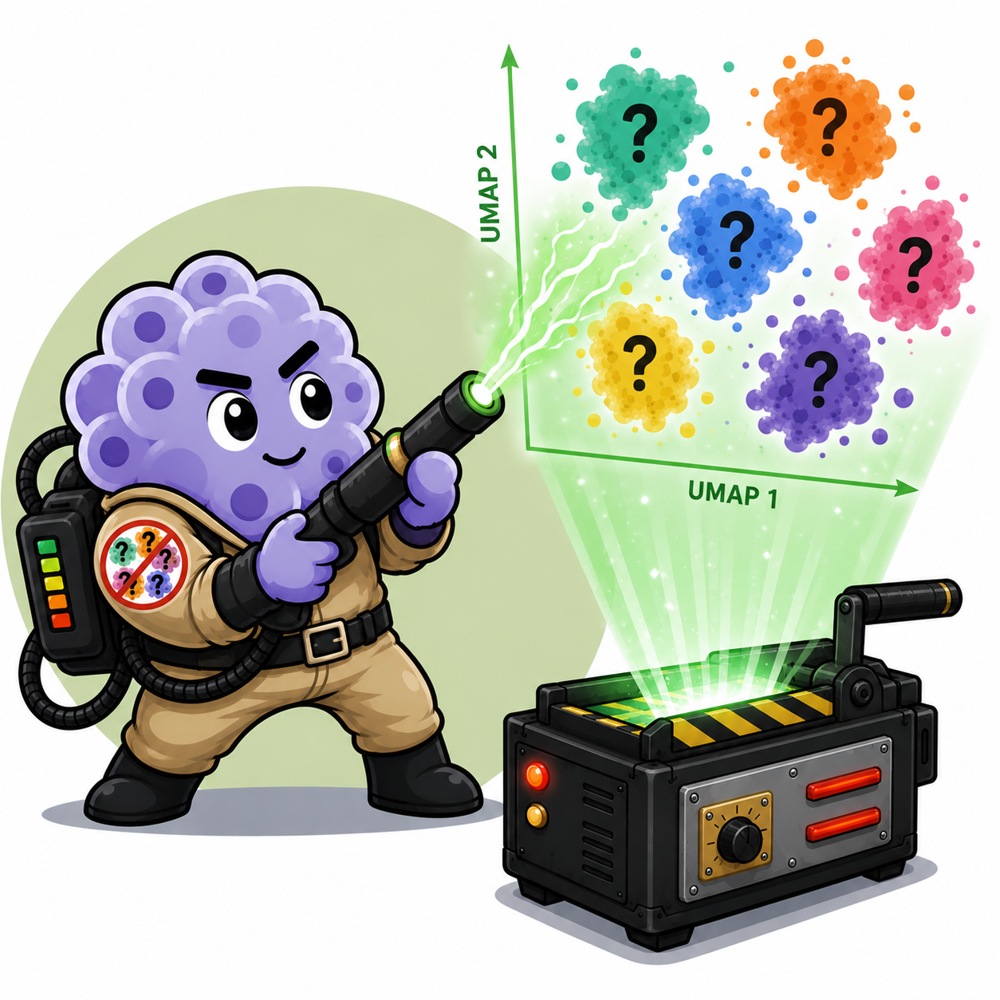

# ClustBuster



ClustBuster is a Python-first web application for assisted annotation of
single-cell RNA-sequencing clusters. The current AnnData-native MVP supports
H5AD input.

## Development

Requirements: Python 3.11–3.14 and [uv](https://docs.astral.sh/uv/).

```bash
uv sync --extra dev
uv run pytest
uv run ruff check .
uv run shiny run --reload src/clustbuster/app.py
```

Container verification is available with:

```bash
docker build -t clustbuster:test .
scripts/container_smoke.sh clustbuster:test
```

The application is intentionally session-scoped. Uploaded data will live in an
ephemeral workspace and the source upload will never be modified. Download all
exports before the session or container is removed.

## Current scope

- Typed, format-independent workspace and expression-source models
- Independent cluster annotation state with type-safe cluster identifiers
- Session-isolated H5AD upload, structural validation, and import reports
- Cluster-column, embedding, and expression-source configuration
- Interactive Plotly/WebGL embedding colored by source cluster or annotation
- Sparse-safe multi-gene feature plots and cluster-by-gene dot plots
- Autosaving cluster annotation controls
- Cluster- and cell-level annotation CSVs packaged as a ZIP
- Annotated H5AD export with provenance and reopen validation
- Import and resource-provider protocols
- Configuration from a single validated startup object
- Shiny application and non-root Docker image
- Automated independent-session and hardened-container smoke tests

Manual fixtures are documented in `testdata/`. Seurat and SingleCellExperiment RDS
round-tripping is not currently supported.
